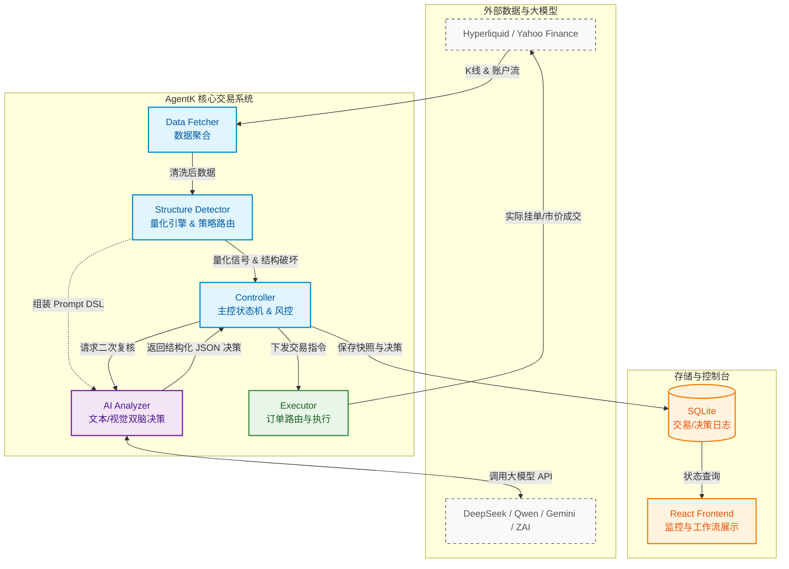

---
aliases:
  - AgentK Overview
  - 系统架构
tags:
  - architecture
  - overview
  - agentk
date: 2026-04-19
---

# 项目总览

> [!abstract] 核心定位
> AgentK 是一个基于 ==AI== 和 ==量化指标== 的自动化交易控制系统，设计用于在复杂的金融（Crypto/美股）市场中执行交易策略。

## 系统架构图

## 核心层级

AgentK 采用高度模块化的 Node.js / TypeScript 架构，主要由以下核心层级组成：

> [!note] 核心组件
> - **Controller (控制器层)**: `src/controller` 负责核心交易逻辑、风险策略管理（Risk Caps, Emergency Close）、AI 交互降温 (AI Close Cooldown) 及状态管理。
> - **Modules (模块层)**: 具体承担各类数据计算与执行，包含 [[#主要模块解析]]。
> - **HTTP/API / Runtime**: 包含 API 路由、云端日志及 Telegram 机器人通知模块。
> - **Frontend**: 包含一个 Vite + React 的前端控制台，用于可视化交易工作流、文档生成和状态查询。

### 主要模块解析

- **Analyzer**: 负责 AI 推理、文本决策生成（DeepSeek, Qwen, Zai 等 LLM）及视觉感知建模（Gemini Vision, Zai Vision）。主要文件位于 `src/modules/analyzer`。
- **Structure Detector**: `src/modules/structure-detector` 是系统的**量化核心**，负责识别市场结构，如位移 (Displacement)、流动性 (Liquidity)、盘整区 (Consolidation)、趋势 (Trend) 及第三次推升衰竭 (Third Push Exhaustion)。支持的标准策略参考 [[策略出入场条件]]。
- **DataFetcher**: 从 Hyperliquid 和 Yahoo Finance 聚合和获取市场 K 线数据及账户信息。
- **Executor**: 实际执行交易指令，包括路由执行 (Router Executor) 与老虎证券/Hyperliquid 接口适配。
- **Position/Risk/Order Managers**: 负责仓位管理、挂单监控和风控计算。
- **State Store**: 负责记录决策日志 (Decision Log)、交易日志 (Trade Log) 和市场快照 (Market Snapshot)，支持 SQLite。
- **Paper Trading**: 模拟交易引擎和统计。

## 技术栈

- **语言**：TypeScript / Node.js
- **核心依赖**：LLM 客户端（DeepSeek, Qwen, Zai, Gemini）、Hyperliquid API, Viem。
- **数据库**：SQLite (用于本地存储 KV 和日志)
- **前端**：Vite + React (SWC)

## 模块文档索引

本 Wiki 维护内容基于 `AgentK-Docker` 的最新代码（通过 Repomix 快照生成）。详细信息请参考各个具体模块说明：
- [[项目总览]]
- [[策略出入场条件]]
- [[核心交易工作流]]
- [[自动反转机制]]