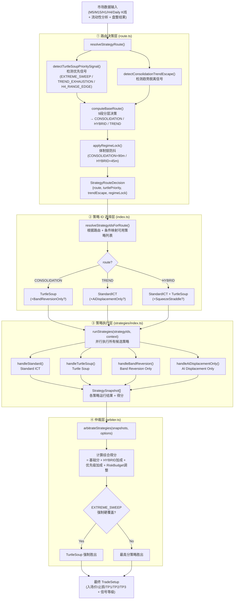
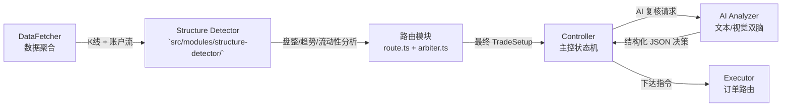

---
aliases:
  - Strategy Routing Module
  - 路由模块
  - 策略选择系统
tags:
  - module
  - routing
  - strategy
  - architecture
date: 2026-04-20
---

# 策略路由模块 (Strategy Routing Module)

> [!abstract] 模块定位
> 策略路由模块是 AgentK 的核心决策层，负责回答一个问题：**在当前市场环境下，应该跑哪个策略、跑还是不跑？**
> 它处于数据获取和最终执行之间，是所有交易信号的过滤器和仲裁者。

---

## 整体流程



---

## ① 路由决策层

> 核心文件：`src/modules/structure-detector/strategies/route.ts`

### 输出路由类型

| 路由值 | 含义 | 典型市场状态 |
|--------|------|------------|
| `CONSOLIDATION` | 纯震荡，不跑趋势策略 | BB 带宽极窄，价格频繁穿越 VWAP |
| `HYBRID` | 混合，趋势和反转策略并行 | 边界模糊，有位移但也有假突破迹象 |
| `TREND` | 明确趋势，优先 ICT 类策略 | H1 MSS/BOS 确认，ATR 扩张 |

### 9 段分层决策 (`computeBaseRoute`)

```
Section 1 → 高置信度盘整 → CONSOLIDATION（除非挤压突破穿透）
Section 2 → TurtleSoup 优先信号触发 → 至少 HYBRID
Section 3 → RangeMode 已激活 → 维持 HYBRID（不立即回 TREND）
Section 4 → 趋势脱离信号（非 RangeMode） → TREND
Section 5 → 盘整置信度 40-50（灰区） → HYBRID / CONSOLIDATION
Section 6 → 盘整置信度 55-65（中等） → HYBRID
Section 7 → 明确趋势信号 → TREND
Section 8 → Hurst 打平局（NOISY 降级到 HYBRID）
Section 9 → 挤压突破兜底 → 至少 HYBRID
```

### 优先信号 (`TurtleSoupPrioritySignal`)

路由过程中会并行检测三类优先信号，任意触发都会阻止 TREND-only 路由：

| 信号来源 | 触发条件 | 影响 |
|---------|---------|------|
| `EXTREME_SWEEP` | 价格刺穿高质量流动性水平（PDH/PDL/Equal Highs-Lows/H4 Equal）并出现扫损 | 路由强制 ≥ HYBRID，且 Arbiter 层强制 TurtleSoup 胜出 |
| `TREND_EXHAUSTION` | 显著位移后随即出现大影线，动能衰减 | 路由 ≥ HYBRID |
| `H4_RANGE_EDGE` | H4 宏观区间高低点处出现价格再占位 (Reclaim) | 路由 ≥ HYBRID |
| 第三推耗尽 at HTF Swing | 非盘整趋势市中接近 H4 摆动极值时检测到三推完成（score ≥ 55，距离 ≤ 1.0 ATR） | 路由 ≥ HYBRID |

### 体制锁 (`applyRegimeLock`)

防止路由在相邻周期高频抖动：

```
盘整置信度 ≥ 65 → 锁定 CONSOLIDATION，持续 90 分钟
盘整置信度 ≥ 55 → 锁定 HYBRID，持续 45 分钟
锁定期间若基础路由回到 TREND 但置信度 ≥ 50 → 维持旧锁
```

---

## ② 策略 ID 选择层

> 核心函数：`resolveStrategyIdsForRoute()` in `src/modules/structure-detector/index.ts`

根据路由类型和当前市场状态，映射出本轮可执行的策略列表：

| 条件 | 可激活策略 |
|------|-----------|
| `CONSOLIDATION` | `TURTLE_SOUP`, (`BAND_REVERSION_ONLY` 若 Shadow Lane 开启) |
| `TREND` | `STANDARD_ICT`, (`AI_DISPLACEMENT_ONLY` 若高位移) |
| `HYBRID` | `STANDARD_ICT` + `TURTLE_SOUP`, (`SQUEEZE_STRADDLE` 若挤压检测通过) |
| + `allowFirstImpulsePullback=true` | Standard ICT 追加 First Impulse 子模式 |
| + `allowConsolidationContinuation=true` | Standard ICT 追加盘整回撤延续子模式 |

---

## ③ 策略执行层

> 核心文件：`src/modules/structure-detector/strategies/index.ts`

`runStrategies()` 按顺序调用各策略的 Handler，每个 Handler 封装了对应策略的完整检测逻辑：

```
handleStandard()         → detectStandardSetup()       (standard-ict.ts)
handleTurtleSoup()       → detectTurtleSoupSetup()      (turtle-soup.ts → 三级 cascade)
handleBandReversion()    → detectBandReversionOnlySetup() (band-reversion-only.ts)
handleAiDisplacementOnly() → detectAiDisplacementOnlySetup() (ai-displacement-only.ts)
```

> [!note] TurtleSoup Handler 特殊处理
> `handleTurtleSoup()` 在调用策略前会额外：
> 1. 检测 H1 三推耗尽 (`detectThirdPushExhaustion`) 并作为加分上下文传入
> 2. 判断是否走 `preferSfpExecution`（H4 边界扫损候选时跳过 Band/VWAP）
> 3. 通过 `isH4BoundarySweepCandidate()` 识别是否为 H4 边界候选

每个 Handler 返回一个 `StrategySnapshot`，包含：
- `setup?: TradeSetup`（有效信号时填充入场参数）
- `diagnostics: string[]`（调试诊断链）
- `score: number`（信号质量分）
- `focus: StrategyMarketFocus`（`RANGE` / `TREND`，用于仲裁加成计算）

---

## ④ 仲裁层 (Arbiter)

> 核心文件：`src/modules/structure-detector/strategies/arbiter.ts`

当多个策略在同一周期产生有效信号时，`arbitrateStrategies()` 通过综合评分选出最终胜者：

### 评分公式

```
综合分 = 基础分 (策略内部 score)
       + HYBRID 路由加成 (getHybridBonus)
       + 优先级加成 (turtlePriority → +2)
       + Risk Budget 调整 (evaluateRiskBudget)
```

### HYBRID 路由加成 (`getHybridBonus`)

HYBRID 路由时，不同市场偏好的策略加成不同：

| 策略 Focus | 路由 Reason 是否偏向震荡 | 加成 |
|-----------|----------------------|------|
| `RANGE`（TurtleSoup 类） | 是（如 `RANGE_MODE`、`EXTREME_SWEEP`） | 较高加成 |
| `RANGE` | 否 | +2（兜底） |
| `TREND`（ICT 类） | 任意 | +2（向后兼容） |

### EXTREME_SWEEP 强制覆盖

```
若 turtlePrioritySource === 'EXTREME_SWEEP'
  → TurtleSoup 直接获得 +30 诊断分
  → 硬覆盖：TurtleSoup 无条件胜出，无论其他策略得分多高
```

### Risk Budget 惩罚 (`evaluateRiskBudget`)

- 当前持仓方向与信号方向**相反** → 得分惩罚（不建议直接对冲）
- 处于方向**冷却期** (`cooldown`)，方向与冷却方向相同 → 进一步惩罚

---

## 数据接口总览

```typescript
// 路由决策输入
interface StrategyRouteContext {
    currentPrice: number;
    displacement?: Displacement;
    m15Candles?: Candle[];
    h4Candles?: Candle[];
    atr?: number;
    now?: number;
    liquidity?: LiquidityAnalysis;
    rangeModeAssessment?: { active: boolean; reason?: string };
    h4Structure?: { swingHighs: SwingPoint[]; swingLows: SwingPoint[] };
}

// 策略执行输入（超集）
interface StrategyExecutionContext {
    // K线数据
    m5Candles, m15Candles, h1Candles, h4Candles: Candle[];
    // 结构分析结果
    h1Structure, m15Structure, m5Structure, h4Structure: TimeframeStructure;
    // 量化指标
    liquidity: LiquidityAnalysis;
    consolidation: ConsolidationResult;
    trendContext?: TrendContext;
    // PD Array
    allFVGs, allOBs, h4FVGs?, h4OBs?: ...;
    // 风控
    riskContext?: { cooldown? }; 
    strategyProfile: StrategyProfile;  // CALM/STABLE/BALANCED/VOLATILE
    // 路由上下文（已决策结果）
    route?: StrategyRoute;
    turtlePrioritySignal?: TurtleSoupPrioritySignal;
    turtlePriorityContext?: TurtlePriorityContext;
    rangeModeAssessment?: RangeModeAssessment;
}

// 仲裁结果
interface ArbitrationResult {
    selected: StrategySnapshot | null;   // 胜出策略的快照（含完整 TradeSetup）
    breakdown: ArbitrationBreakdown[];   // 各策略得分明细（供日志/调试）
}
```

---

## 与其他模块的关系



路由模块是 Structure Detector 内部的最后一道关卡，它的输出（`TradeSetup`）直接交付给 Controller 层进行 AI 复核和最终执行决策。

---

## 参考

- 路由决策: `src/modules/structure-detector/strategies/route.ts`
- 策略注册 & 执行: `src/modules/structure-detector/strategies/index.ts`
- 仲裁器: `src/modules/structure-detector/strategies/arbiter.ts`
- 风险预算: `src/modules/structure-detector/strategies/arbiter-risk.ts`
- 结构检测统一入口: `src/modules/structure-detector/index.ts`
- 概念层说明: [[策略路由]]
- 各策略详解: [[策略详解-StandardICT]] · [[策略详解-TurtleSoup]] · [[策略详解-SqueezeStraddle]] · [[策略详解-BandReversion]]
